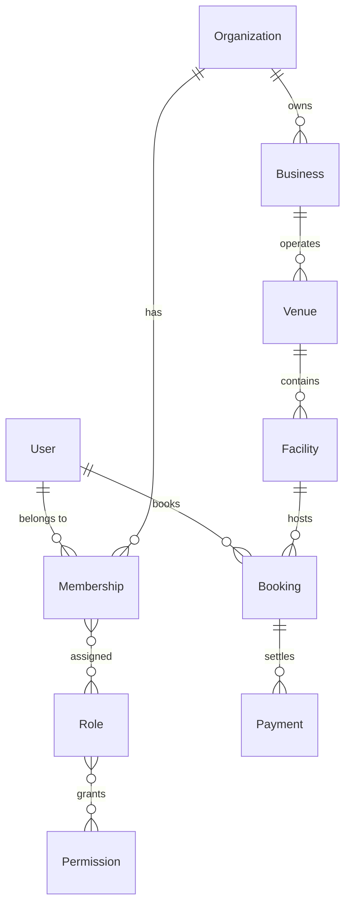
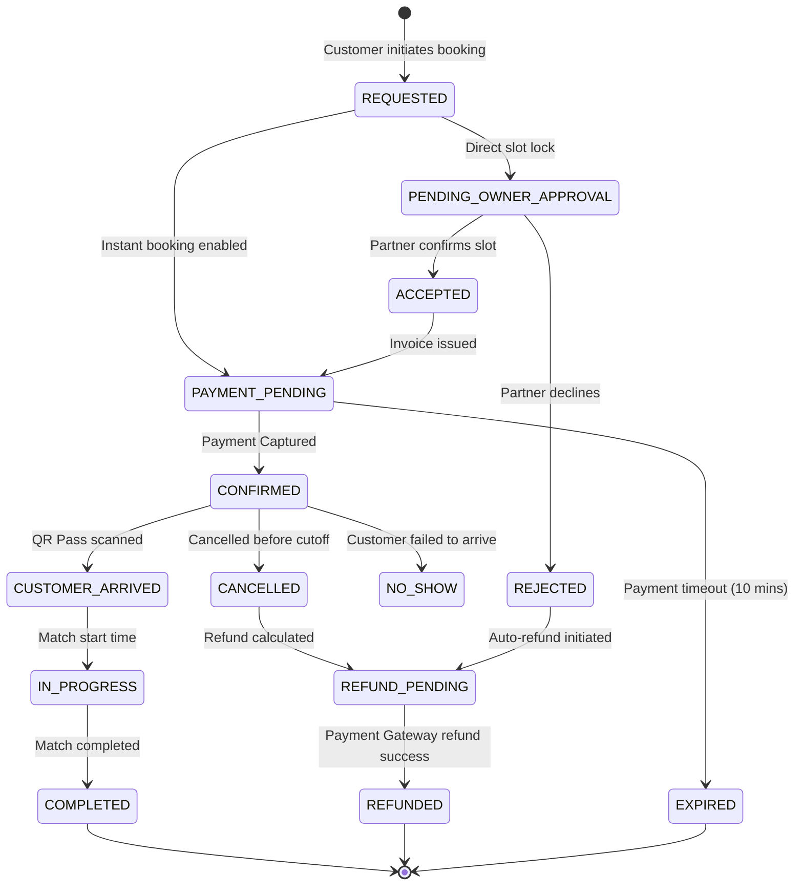
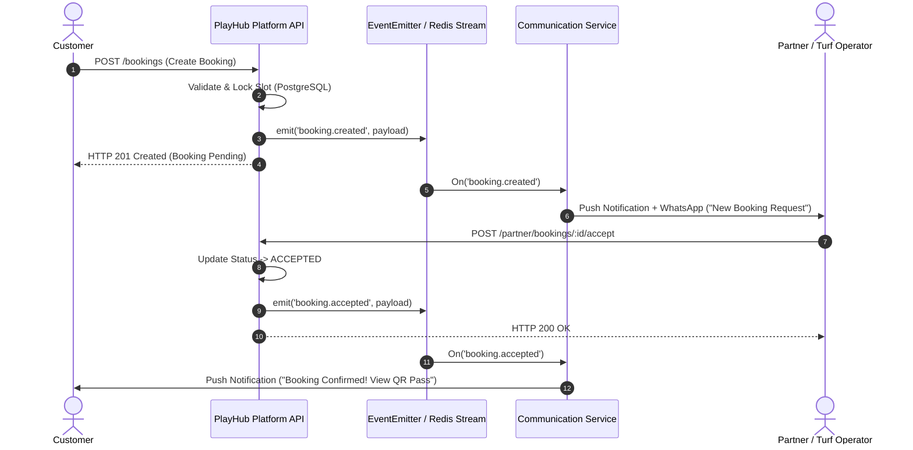

# PlayHub Platform Architecture & Three-Application Foundation
**Phase 53 Master Architecture Specification**
*Target Platform Scale: 1,000,000+ Active Users, Multi-City, Multi-Tenant Sports Marketplace*

---

## 1. Executive Strategy: The Three-Product Ecosystem

PlayHub is engineered as a unified, high-scale sports platform supporting three dedicated client products communicating with a centralized, event-driven backend platform API:

```
┌─────────────────────────────────────────────────────────────────────────────┐
│                            PLAYHUB CLIENT TIERS                             │
├──────────────────────────┬──────────────────────────┬───────────────────────┤
│    PLAYHUB CUSTOMER      │     PLAYHUB PARTNER      │   PLAYHUB OPERATIONS  │
│       (Mobile App)       │    (Mobile & Tablet)     │   (Internal Web/Admin)│
│  Players, Athletes &     │  Turf Owners, Managers,  │ Super Admin, Ops, CS, │
│  Sports Communities      │  Staff & Ground Ops      │ Finance, Risk & Trust │
└────────────┬─────────────┴────────────┬─────────────┴───────────┬───────────┘
             │                          │                         │
             ▼                          ▼                         ▼
┌─────────────────────────────────────────────────────────────────────────────┐
│                 PLAYHUB API GATEWAY & PLATFORM API (/api/v1)                │
│             (NestJS + Fastify/Express, Stateless, Horizontal Pods)           │
├─────────────────────────────────────────────────────────────────────────────┤
│ • Auth & Session Mgmt    • Booking Engine & Locks   • Payment & Settlement  │
│ • Multi-Tenant RBAC      • Communication & Devices  • Tournaments & Matches │
│ • Discovery & Catalog    • Reviews & Ratings        • Support & Disputes    │
└───────────────────────────────────────┬─────────────────────────────────────┘
                                        │
             ┌──────────────────────────┴──────────────────────────┐
             ▼                                                     ▼
┌───────────────────────────┐                        ┌────────────────────────┐
│   PostgreSQL 16 Engine    │                        │  Redis 7 + BullMQ Hub  │
│  (Prisma ORM, ACID Trans, │                        │ (Distributed Caching,  │
│   PgBouncer, Read-Replicas│                        │  Queues & Async Events)│
└───────────────────────────┘                        └────────────────────────┘
```

---

## 2. Product Boundaries & Application Architecture

### A. PlayHub Customer Application (Mobile / Consumer)
- **Target Audience**: Recreational players, amateur athletes, sports teams, and local community organizers.
- **Core UI/UX Reference**: PlayHub V3 Design Language (Indigo/Violet vibrant aesthetics, glassmorphic cards, micro-interactions, responsive bottom navigation).
- **Core Capabilities**:
  - Venue discovery, distance filtering, multi-sport category navigation.
  - Interactive 14-day calendar & available time-slot selection.
  - Instant checkout with UPI, Cards, Netbanking, and PlayHub Wallet.
  - Digital QR Entry Pass ticket with live countdown and venue navigation.
  - Match discovery, Host Match form, join match roster, and player invites.
  - Tournaments & Leagues catalog with team registration stepper.
  - Community feed with club channels, image sharing, likes, and comment threads.
  - Customer profile, wallet top-up, security controls (2FA/biometrics), and support center.

### B. PlayHub Partner / Owner Application (Operations / Business)
- **Target Audience**: Facility owners, turf operators, venue managers, front-desk staff.
- **Core Design Objective**: High-contrast, dense operational workflow, instant booking push notifications, rapid check-in QR scanner.
- **Core Capabilities**:
  - Business onboarding, KYC verification (PAN, GSTIN, Bank account, registration certificates).
  - Multi-venue and multi-facility (court/pitch/table) hierarchy management.
  - Granular dynamic pricing (base, peak hours, weekend, duration rules).
  - Slot availability management & emergency/maintenance blocking.
  - Real-time booking alerts with One-Tap Accept / Reject actions.
  - Ground operations check-in (Scan Customer QR, Mark Arrived, Mark No-Show).
  - Business finance: Real-time gross booking value (GBV), commission deductions, payout requests, settlement statements, GST invoices.
  - Multi-user staff permission delegation (Owner vs Manager vs Front-Desk Staff).

### C. PlayHub Internal Admin & Operations Platform (Internal / Web)
- **Target Audience**: Super Administrators, City Ops Managers, Customer Support Agents, Finance Controllers, Risk & Fraud Analysts, Marketing Directors.
- **Core Design Objective**: Data-dense grid tables, multi-parameter filtering, audit log tracking, mass approval queues, override and refund capabilities.
- **Core Capabilities**:
  - Platform-wide telemetry (Total Users, Active Venues, Daily Booking Velocity, GMV).
  - Vendor & Venue Onboarding Verification Queue with KYC document inspect and approval/rejection notes.
  - Customer Support & Dispute Resolution Console (Ticket SLA tracking, internal notes, booking context lookup, override actions).
  - Payments & Payouts Engine (Vendor settlement generation, commission ledger, authorized manual refunds).
  - Master Data Governance (Cities, Sports Categories, Activity Types, System Parameters).
  - Enterprise RBAC User Administration (Granular role assignment, account suspensions).
  - Immutable platform audit trails.

---

## 3. Identity & Multi-Tenancy Architecture

### A. Unified Identity Model
A user possesses a single global account (`User`) with verified credentials (email, phone, password hash, OAuth identities). The user's capabilities adapt dynamically based on their tenant memberships and platform roles:



### B. Role-Based Access Control (RBAC) Matrix

| Platform Role | Scope | Key Permissions & Capabilities |
|---|---|---|
| **CUSTOMER** | Self | Create/view own bookings, join matches, register tournaments, write reviews, create support tickets, manage personal wallet. |
| **PARTNER_OWNER** | Organization | Full authority over owned business, venues, facilities, pricing, availability blocks, booking operations, payouts, staff management. |
| **PARTNER_MANAGER** | Assigned Venues | Venue/facility operational updates, schedule blocking, booking accept/reject/check-in, operational business analytics. |
| **PARTNER_STAFF** | Facility / Shift | View today's schedule, scan customer QR pass, mark customer arrived / no-show. |
| **PLAYHUB_SUPER_ADMIN**| Platform Global | Unrestricted wildcard (`*`) access across all tenants, platform configurations, financial ledgers, and database controls. |
| **PLAYHUB_ADMIN** | Platform Global | Organization management, business/venue approval, booking overrides, user role management, system settings. |
| **PLAYHUB_OPERATIONS** | Platform Global | City/vendor onboarding review, venue verification, operational booking reviews. |
| **PLAYHUB_SUPPORT** | Customer / Ticket | View customer profiles, booking logs, payment status, resolve support tickets, initiate dispute workflows. |
| **PLAYHUB_FINANCE** | Financial Global | Audit payouts, review payment transactions, authorize dispute refunds, download financial reconciliation reports. |
| **PLAYHUB_RISK** | Platform Global | Fraud monitoring, account suspension, dispute escalation, security audit review. |
| **PLAYHUB_MARKETING** | Content / Community | Moderate community feed, manage promotional banners, organize official platform tournaments. |

---

## 4. Tenant Isolation & IDOR Protection

1. **Server-Side Enforcement**: All business and administrative mutations strictly enforce tenant ownership on the backend. Client-provided `organizationId` is never trusted blindly.
2. **Organization Context Verification**: `OrganizationGuard` verifies that `req.user.id` possesses an active `Membership` in the target `organizationId` and binds verified permissions to `req.user.permissions`.
3. **Resource Ownership Traversal**: Before modifying any child resource (e.g. `Facility`, `AvailabilityBlock`, `PricingRule`, `Booking`), the service traverses the relational hierarchy:
   $$\text{Facility} \rightarrow \text{Venue} \rightarrow \text{Business} \rightarrow \text{OrganizationId}$$
   If `Facility.venue.business.organizationId \neq req.organizationId`, a `403 Forbidden` / `404 Not Found` is thrown.

---

## 5. Booking Lifecycle & State Machine



### Concurrency & Double-Booking Protection
- **Transactional Slot Locks**: Time slots are locked inside a PostgreSQL serializable transaction (`prisma.$transaction`) evaluating overlapping intervals:
  $$\text{Interval}_{\text{req}} \cap \text{Interval}_{\text{existing}} \neq \emptyset \implies \text{ConflictException (409)}$$
- **Idempotency Keys**: All booking creation requests require a unique client-generated `Idempotency-Key` header stored in `bookings.idempotencyKey` to prevent duplicate billing from network retries.

---

## 6. Payment & Financial Architecture

### Payment State Machine
$$\text{PAYMENT\_INITIATED} \longrightarrow \text{PAYMENT\_PENDING} \longrightarrow \begin{cases} \text{CAPTURED} \longrightarrow \text{SETTLED} \longrightarrow \text{PAYOUT} \\ \text{FAILED} \\ \text{CANCELLED} \\ \text{REFUND\_REQUESTED} \longrightarrow \text{REFUNDED} \end{cases}$$

### Financial Split & Payout Calculation
For every confirmed booking of gross amount $G$:
1. **Platform Commission**: $C = G \times r_{\text{comm}} + \text{Tax}$
2. **Vendor Net Accrual**: $N = G - C$
3. **Escrow Hold Period**: Net accrual is held in pending status until $\text{Booking.status} = \text{COMPLETED} + \text{Grace Period} (24\text{ hours})$.
4. **Automated Payout Batch**: Daily settlement cron aggregates eligible completed bookings and initiates payout transfers to partner bank accounts via RazorpayX / Stripe Connect.

---

## 7. Event-Driven Communication Architecture

Domain events decouple business logic from real-time alerting, push dispatch, and email processing:



---

## 8. Queue & Background Worker Architecture (Scale to 1M Users)

- **Engine**: Redis 7.0 + BullMQ distributed workers.
- **Queues**:
  1. `queue:notifications`: Push, SMS (Twilio/Gupshup), WhatsApp (Meta Business API), Email (SES/Sendgrid) with retry backoff and rate-limiting.
  2. `queue:booking-sweeper`: Scheduled check firing every 60s to expire unconfirmed `PAYMENT_PENDING` bookings and release inventory.
  3. `queue:financial-reconciliation`: Nightly batch job reconciling payment gateway webhooks against internal payment ledgers.
  4. `queue:analytics-aggregator`: Asynchronous calculation of daily venue occupancy rates and GMV rollups.

---

## 9. API Design & Versioning Strategy

- **Base URL Prefix**: `/api/v1`
- **Contract Stability**:
  - Non-breaking changes (additive fields, optional query parameters) are published within `/api/v1`.
  - Breaking schema adjustments require a new version namespace (`/api/v2`).
- **Standardized Response Envelope**:
  ```json
  {
    "success": true,
    "data": { ... },
    "meta": {
      "page": 1,
      "limit": 20,
      "total": 150
    },
    "timestamp": "2026-08-29T12:00:00.000Z"
  }
  ```

---

## 10. Security Architecture

1. **Authentication**: Stateless JWT access tokens (15-min TTL) paired with cryptographically hashed rotating refresh tokens (7-day TTL) stored in `sessions` with session-family revocation on reuse detection.
2. **Device Registration**: Push notification tokens securely registered and mapped to user IDs (`/api/v1/communication/devices`).
3. **Rate Limiting**: Distributed rate-limiting via Redis (`ThrottlerModule`):
   - Auth endpoints: 5 requests / minute
   - Booking/Payment endpoints: 30 requests / minute
   - Public Discovery endpoints: 120 requests / minute
4. **Webhook Security**: Cryptographic HMAC SHA256 signature verification on all Razorpay/Stripe webhooks with idempotency tracking in `payment_webhook_events`.

---

## 11. Media Storage & CDN Architecture

- **Current Baseline**: Local multi-part storage (`backend/uploads/`) with media metadata indexing in PostgreSQL.
- **Scale Target (1M Users)**:
  - Client requests pre-signed upload URL from `/api/v1/media/presigned-url`.
  - Direct client-to-bucket PUT upload to S3-compatible Object Storage (Cloudflare R2 / AWS S3).
  - Global edge CDN distribution (Cloudflare / AWS CloudFront) with automatic WebP conversion.

---

## 12. Observability & Telemetry

1. **Structured Logging**: JSON-formatted application logs with correlation IDs (`x-correlation-id`) across all request contexts.
2. **Health & Readiness Endpoints**:
   - `GET /api/v1/health` (Liveness)
   - `GET /api/v1/health/readiness` (Deep check verifying PostgreSQL database and Redis connections).
3. **Audit Logging**: All sensitive mutations (role assignments, refunds, business approvals, user suspensions) recorded immutably in `audit_logs` with actor ID, IP address, and change payload.

---

## 13. Flutter Multi-Target Architecture Foundation

To maintain clean modularity while preventing duplicate maintenance across Customer, Partner, and Admin mobile/tablet surfaces:

- `lib/core/`: Common domain models, API client, secure storage, authentication state, logging.
- `lib/shared/`: Shared design tokens, buttons, dialogs, status badges, skeletons.
- `lib/features/`: Feature modules partitioned by domain:
  - `lib/features/customer/` (Venues discovery, match finding, tournaments, bookings, social feed, wallet)
  - `lib/features/partner/` (Business dashboard, venue operations, availability blocks, QR pass scanner, payouts)
  - `lib/features/admin/` (Platform statistics, user management & RBAC, approvals queue)
- `lib/app/router/router.dart`: Centralized routing with strict role guards preventing customer accounts from accessing partner or administrative routes without proper claims.

---

## 14. Master Roadmap & Future Phase Sequence

| Phase | Title | Focus Area |
|---|---|---|
| **Phase 53** | **Platform Architecture + Three-Application Foundation** | **Core multi-tenant RBAC, role definitions, domain events, security enforcement, master architectural specification (Current)** |
| Phase 54 | Partner Application: Business Onboarding & Multi-Venue Management | Dedicated partner portal, KYC verification, multi-court facility configuration |
| Phase 55 | Partner Application: Dynamic Pricing & Availability Engine | Peak/off-peak rules, automated calendar maintenance locks, recurring availability |
| Phase 56 | Partner Application: Real-Time Booking Operations & QR Scanner | Real-time booking alert socket, check-in QR scanner, mark arrived/no-show |
| Phase 57 | Partner Application: Business Finance, Settlements & Payouts | GBV calculation, commission tracking, payout requests, GST invoices |
| Phase 58 | Internal Admin Platform: Operations & Approval Workflows | KYC document review queue, venue approvals, dispute management console |
| Phase 59 | Internal Admin Platform: Financial Governance & Audit Suite | Global ledger reconciliation, refund authorization, immutable audit logs |
| Phase 60 | Customer Ecosystem: Advanced Discovery, Maps & Geolocation | Mapbox/Google Maps integration, live distance radius filtering |
| Phase 61 | Scalability: Redis Caching Layer & BullMQ Background Queues | Distributed caching, background async job queues |
| Phase 62 | Scalability: Object Storage (S3/R2) & CDN Migration | Pre-signed upload workflows, edge CDN delivery |
| Phase 63 | Customer Loyalty: Memberships, Coupons & Referral Engine | Recurring memberships, promotional discount codes, referral credits |
| Phase 64 | Real-Time WebSockets & Live Match Chat | Bi-directional communication for match discovery and team rosters |
| Phase 65 | Enterprise QA, Load Testing & 1M User Benchmark | K6 load testing, concurrency stress testing, production hardening |
