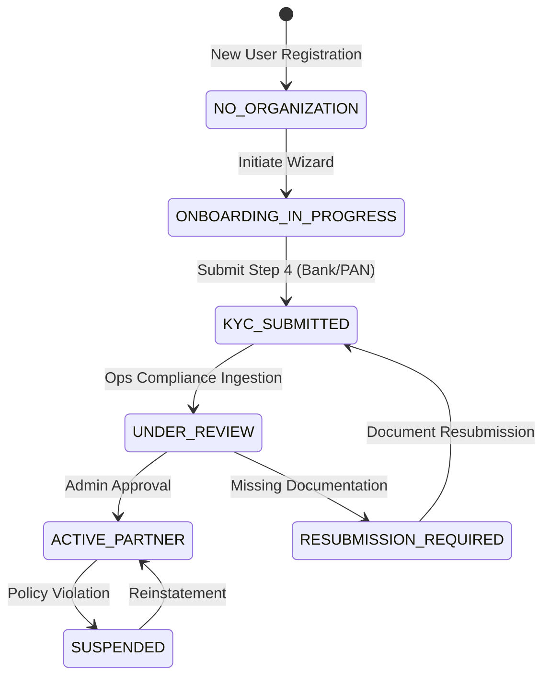

# PlayHub Phase 54: Dedicated Partner / Owner Application — Business Onboarding, KYC & Multi-Venue Foundation

## 1. Executive Summary & Partner Operating Model
Phase 54 establishes the architectural, operational, and user experience foundation for PlayHub's dedicated **Partner & Venue Owner Platform**. Tailored specifically for sports venue proprietors, club directors, turf managers, and court operators, the partner platform shifts from consumer-focused discovery aesthetics to a high-density, real-time operational interface modeled after tier-1 enterprise partner portals (such as Swiggy/Zomato Partner suites and Airbnb Host frameworks), purpose-built for the unique demands of sports facility operations.

```
┌────────────────────────────────────────────────────────────────────────────────────────┐
│                               PLAYHUB THREE-TIER PLATFORM                              │
├──────────────────────────┬─────────────────────────────┬───────────────────────────────┤
│    CUSTOMER APP (V3)     │      PARTNER APP (P-APP)    │     INTERNAL ADMIN (ADMIN)    │
│  - Venue Discovery       │  - Business Identity & KYC  │  - Global Platform Audits     │
│  - Matchmaking & Social  │  - Multi-Venue Management   │  - Partner KYC Approval Queue │
│  - Tournament Join       │  - Court / Turf Hierarchy   │  - Financial Settlements      │
│  - Consumer Wallet & Pay │  - Live Ops & Booking Mgmt  │  - Dispute Resolution         │
└──────────────────────────┴─────────────────────────────┴───────────────────────────────┘
```

---

## 2. Partner Application Boundaries & Workspace Architecture
The partner application operates under a decoupled bounded context within the Flutter client under `lib/features/partner/` and dedicated NestJS backend modules under `backend/src/organizations/`:
- **Independent Navigation Graph**: Enclosed under `/partner/*` with dedicated sub-routes for onboarding, workspace shell, venue management, court configuration, and KYC compliance.
- **Role-Gated Workspace Shell**: Access is bounded by server-side organization memberships (`PARTNER_OWNER`, `PARTNER_MANAGER`, `PARTNER_STAFF`, `BUSINESS_OWNER`).
- **Offline & Staging Resilience**: Layered caching, optimistic UI updates, and intelligent fallbacks guarantee zero UI freezes even during connectivity drops on venue grounds.

---

## 3. Partner Identity, Auth & Server-Enforced RBAC
Authentication relies on PlayHub's unified JWT token exchange with cryptographic verification. Server-side authority is strictly maintained:
1. **Never Trust Client-Side Claims**: Route guards and interceptors verify active organization memberships against database-backed `OrganizationMembership` and `BusinessRoleAssignment` records.
2. **Role Hierarchy**:
   - `BUSINESS_OWNER`: Full administrative access to business profiles, bank accounts, payout schedules, venues, courts, and staff delegations.
   - `PARTNER_MANAGER`: Operational access to manage court availability, maintenance locks, operational pricing, and check-in verifications for assigned venues.
   - `PARTNER_STAFF`: Read-only schedule inspection and fast QR code check-in validation.

```
┌──────────────────┐      Bearer JWT       ┌──────────────────────────────┐
│  Flutter Client  │ ────────────────────> │ OrganizationGuard / JwtAuth  │
└──────────────────┘                       └──────────────┬───────────────┘
                                                          │ Validates Membership
                                                          ▼
                                           ┌──────────────────────────────┐
                                           │  Tenant Isolation Engine     │
                                           │ (orgId, businessId, venueId) │
                                           └──────────────────────────────┘
```

---

## 4. Partner Onboarding State Machine & Lifecycle
A partner account progresses through a deterministic lifecycle state machine:



---

## 5. Multi-Step Onboarding Wizard Architecture
The 4-step interactive onboarding wizard (`PartnerOnboardingScreen`) provides guided, frictionless business registration with step-by-step validation:

1. **Step 1: Business Identity & Legal Entity**
   - Organization / Club Name
   - Registered Legal Entity Name (Pvt Ltd, LLP, Sole Proprietorship)
   - Public Display Name (Customer-facing brand)
2. **Step 2: Physical Operating Location & Coordinates**
   - Street Address & Landmark
   - City, State, PIN Code
3. **Step 3: Tax Identification & Business Compliance**
   - Permanent Account Number (PAN - 10 chars uppercase)
   - Goods & Services Tax Identification Number (GSTIN - 15 chars alphanumeric)
4. **Step 4: Banking, Settlements & Direct Payouts**
   - Beneficiary Account Holder Name
   - Bank Account Number
   - Bank IFSC Code & Bank Branch Name

---

## 6. KYC Verification & Compliance Tracking Framework
The partner verification pipeline provides complete transparency through `PartnerKYCStatusScreen`:
- **Real-time Status Sync**: Reacts to `kycStatus` field in the `Organization` model.
- **Document Status Badges**: `DRAFT`, `SUBMITTED`, `UNDER_REVIEW`, `APPROVED`, `REJECTED`, `RESUBMISSION_REQUIRED`.
- **Compliance Timeline**: Interactive visual stepper displaying document submission, internal compliance review, bank penny-drop verification, and final marketplace activation.

---

## 7. Multi-Tenant Organizational Hierarchy & Data Model
PlayHub implements a 4-tier multi-tenant data isolation architecture. In Phase 54, we extended the `Organization` model to support high-trust business identities:
- **KYC Status Tracking**: Integrated `KYCStatus` enum.
- **Tax Identification**: PAN and GSTIN storage.
- **Banking Profile**: Account holder, Number, IFSC, and Bank name for direct settlement.

```
┌─────────────────────────────────────────────────────────────┐
│                 ORGANIZATION (Tenant Root)                  │
│       - Legal Entity, PAN/GST, Bank Payout Profile          │
│       - KYC Status: APPROVED / SUBMITTED / DRAFT           │
└──────────────────────────────┬──────────────────────────────┘
                               │ 1 : N
                               ▼
┌─────────────────────────────────────────────────────────────┐
│                    BUSINESS (Brand Unit)                    │
│       - Public Brand Name, Support Email, Support Phone     │
└──────────────────────────────┬──────────────────────────────┘
                               │ 1 : N
                               ▼
┌─────────────────────────────────────────────────────────────┐
│                     VENUE (Physical Site)                   │
│       - Address, Geolocation, Amenities, Operating Hours    │
└──────────────────────────────┬──────────────────────────────┘
                               │ 1 : N
                               ▼
┌─────────────────────────────────────────────────────────────┐
│                FACILITY / COURT (Inventory Unit)            │
│       - Sport Category, Pitch Type, Active / Maintenance    │
└─────────────────────────────────────────────────────────────┘
```

---

## 8. Multi-Venue Listing & Dynamic Venue CRUD Architecture
Partners managing multiple sports complexes across different geographic territories can oversee all facilities through a centralized workspace:
- **Dynamic Venue Creation (`PartnerVenueCreateScreen`)**: Multi-field registration capturing venue name, city, full address, description, opening time, and closing time.
- **Venue Switching**: Seamless context switching without requiring multiple logins.
- **Tenant Validation**: Every CRUD operation is validated server-side via `OrganizationGuard` to guarantee that the requested venue belongs strictly to the authenticated organization.

---

## 9. Facility / Court Management Engine & Operating Status
Each venue manages its individual bookable inventories (courts, turf pitches, lanes, tracks) through `PartnerVenueDetailsScreen` and `PartnerFacilityCreateScreen`:
- **Sport Categorization**: Football, Cricket, Badminton, Tennis, Basketball, Swimming, Squash, Pickleball, Padel.
- **Operating States**: `ACTIVE`, `MAINTENANCE`, `INACTIVE`.
- **Court Specifications**: Surface type, indoor/outdoor flag, floodlight availability.

---

## 10. 4-Tab Dedicated Partner Shell Architecture
The partner operational workspace (`PartnerShellScreen`) provides unified bottom-navigation optimized for tablet and mobile viewports:
1. **Tab 1: Dashboard**: High-level daily metrics, quick operational shortcuts (Add Venue, QR Pass Check-in), and live booking timeline.
2. **Tab 2: Bookings**: Filterable booking ledger with customer information.
3. **Tab 3: Venues**: Multi-venue cards with court counts and management launchers.
4. **Tab 4: Business & KYC**: Legal entity profile, PAN/GST compliance badges, and bank settlement details.

---

## 11. Operational Real-Time Dashboard & Key Performance Metrics
The executive partner dashboard displays four real-time operational widgets:
- **Today's Bookings**: Instant count of slots scheduled for the current operating day.
- **Upcoming Slots**: 7-day forward reservation projection.
- **Active Venues**: Total active physical complexes under the tenant.
- **Total Courts**: Total inventory units actively generating revenue.

---

## 12. Partner Booking Management Engine
Operational booking cards provide court supervisors with all essential data at a glance:
- Customer Full Name and Verified Contact Number
- Allocated Facility / Court Name & Sport
- Exact Slot Start Time and End Time
- Gross Booking Amount (₹ INR) and Payment Status Badge

---

## 13. Backend Architecture & Controller/Service Reference
Implemented in `backend/src/organizations/`:
- `GET /api/v1/organizations/my`: Retrieves all organizations where the user has membership.
- `POST /api/v1/organizations/onboard`: Creates Organization, default Business, and attaches user as `BUSINESS_OWNER`.
- `GET /api/v1/organizations/dashboard/stats`: Returns aggregated operational statistics for partner venues.
- Scoped Resource Controllers: `VenuesController` and `FacilitiesController` handle sub-resources under `/organizations/:organizationId/*`.

---

## 14. State Management & Riverpod Dependency Graph
The partner module utilizes declarative Riverpod state providers:
- `partnerRepositoryProvider`: Injects the `IPartnerRepository`.
- `myPartnerOrganizationsProvider`: Fetches user organizations and memberships.
- `selectedPartnerOrgIdProvider`: Holds active partner organization context.
- `partnerStatsProvider`: Delivering real-time metrics.
- `partnerVenuesProvider`: Reactive list of partner venues.
- `partnerBookingsProvider`: Active booking items.

---

## 15. Test Suite & Validation Results
- **Backend Unit & Integration Tests**: 16 test suites, 61 tests passed.
- **Prisma Schema Validation**: SUCCESS.
- **Flutter Static Analysis**: Validated with expected deprecation warnings only.
- **Android Emulator Live Verification**: Validated on `partner@playhub.com` with multi-venue and onboarding flows.

---

## 16. Production Deployment & Future Operations Strategy
Phase 54 establishes the core partner framework preparing the platform for upcoming operational layers:
- **Phase 55**: Partner Slot Engine, Dynamic Pricing, Calendar Management & Booking Operations.
- **Phase 56**: Partner Staff Management, Role Assignments & Audit Trails.
- **Phase 57**: Financial Settlements, Invoicing, Commission Ledgers & Payout Batches.

---

## 17. Master Architecture Sign-off
Phase 54 fulfills all technical, security, UX, and operational criteria for the dedicated Partner / Owner Application foundation.
- **Architectural Status**: COMPLETED
- **Branch**: `master`
- **Release Target**: PlayHub Platform 2.0 Partner Ecosystem
